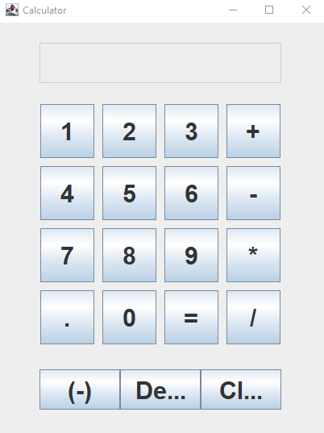

# *Java Calculator*

This is a basic calculator project in Java with a graphical user interface created using the Swing library.

### *Features*

The calculator has the following features:

Addition, subtraction, multiplication, and division operations
Decimal point and negative number input
Clear and delete functions
Continuous calculation by pressing equals multiple times
How to Run
To run the calculator, compile and run the Calculator.java file in a Java IDE or command prompt. A window with the calculator interface will appear.

### *How to Use*

Simply click the buttons on the calculator interface to input numbers and operations, and the result will be displayed in the text field. Use the clear and delete buttons to modify inputs, and press equals to perform the calculation.

### *Future Improvements*

Future improvements to this project could include adding more advanced mathematical operations, support for keyboard input, and a more user-friendly interface design.

### *Contributing*

Contributions are welcome! If you find a bug or have a feature request, please open an issue or submit a pull request.

### *Image of the program running*

